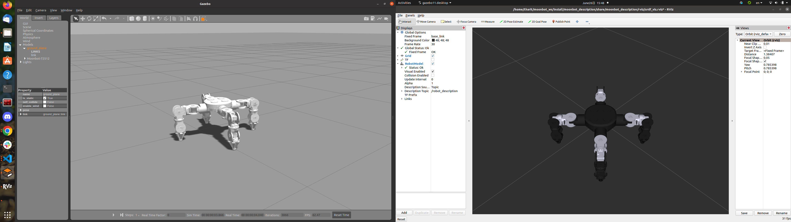

# noppakorn-test

## Add picture
 

## Add GIF
crawl gait(left) and trot gait(right) 

	<!--  -->
	<!--  -->

## Packages description 
#### moonbot_description
&ensp;&ensp;URDF and mesh files for moonbot, Launch file and RVIZ configuration for visualizing the moonbot model

#### moonbot_gazebo
&ensp;&ensp;Model and world file for gazebo simulator. 

<!-- 

  

  

 -->
